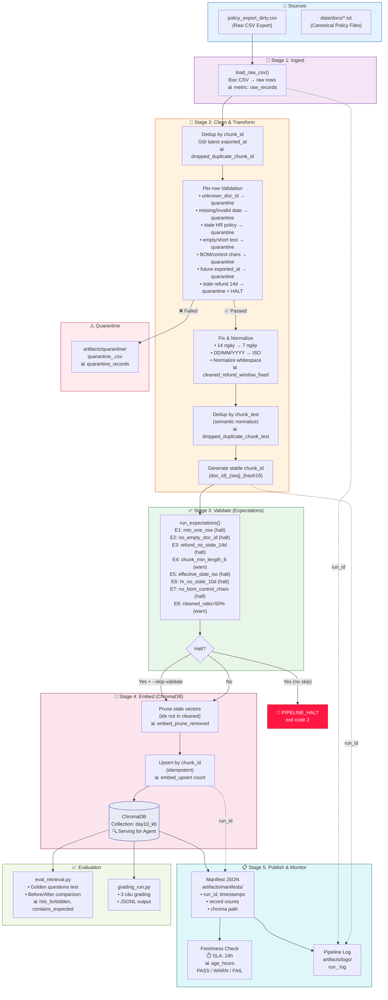

# Kiến trúc Pipeline — Lab Day 10

**Nhóm:** Quality & Observability (Hải, Long) + Transformation (Tuấn, Quang) + DB (Thuận) + Eval (Huy) + Lead (Dũng)  
**Tác giả sơ đồ:** Long  
**Cập nhật:** 2026-04-15

---

## 1. Sơ đồ luồng (Mermaid)



### Sơ đồ đơn giản (ASCII backup)

```
Raw CSV ──→ load_raw_csv() ──→ dedup(chunk_id) ──→ validate(per-row) ──→ fix/normalize
   │                                                      │                    │
   │                                                      ▼                    ▼
   │                                              [QUARANTINE]          dedup(text)
   │                                                                       │
   │                                                                       ▼
   │                                                              stable_chunk_id
   │                                                                       │
   │                                                                       ▼
   │                                                              run_expectations()
   │                                                                  │         │
   │                                                              HALT?     PASS
   │                                                              │  │         │
   │                                                           STOP  skip      │
   │                                                                  │        │
   │                                                                  ▼        ▼
   │                                                         prune stale vectors
   │                                                                  │
   │                                                                  ▼
   ├──── [run_id] ──────────────────────────── upsert ChromaDB (day10_kb)
   │                                                                  │
   │                                                          ┌───────┴───────┐
   │                                                          ▼               ▼
   └──── [Manifest JSON] ◄──── [Freshness ⏱️]          [eval_retrieval]  [grading_run]
                │
                ▼
          [Pipeline Log]
```

> **Điểm đo freshness:** sau embed upsert (publish boundary) — đo `age_hours` từ `latest_exported_at` tới `now`.  
> **run_id:** sinh tại đầu pipeline, ghi vào log + manifest + metadata ChromaDB.  
> **Quarantine:** `artifacts/quarantine/quarantine_<run_id>.csv` — reviewed weekly.

---

## 2. Ranh giới trách nhiệm

| Thành phần | Input | Output | Owner nhóm | File chính |
|------------|-------|--------|------------|------------|
| **Ingest** | `data/raw/policy_export_dirty.csv` | Raw rows in memory | Dũng (Lead) + Tuấn | `etl_pipeline.py`, `cleaning_rules.py::load_raw_csv()` |
| **Transform / Clean** | Raw rows | Cleaned CSV + Quarantine CSV | Tuấn & Quang | `transform/cleaning_rules.py::clean_rows()` |
| **Quality (Validate)** | Cleaned rows | Expectation results (pass/fail/halt) | Hải & Long | `quality/expectations.py::run_expectations()` |
| **Embed** | Cleaned CSV | ChromaDB vectors (upsert + prune) | Thuận | `etl_pipeline.py::cmd_embed_internal()` |
| **Monitor / Docs** | Manifest JSON | Freshness status + Runbook + Reports | Long | `monitoring/freshness_check.py`, `docs/*.md` |
| **Evaluation** | ChromaDB collection | Before/After CSV + Grading JSONL | Huy | `eval_retrieval.py`, `grading_run.py` |
| **Orchestration** | Tất cả stages | Pipeline `run` command, `run_id`, log | Dũng (Lead) | `etl_pipeline.py::cmd_run()` |

---

## 3. Idempotency & Rerun

### Strategy: Upsert + Prune

Pipeline đảm bảo **idempotent** qua 2 cơ chế:

1. **Stable `chunk_id`:** Sinh từ `{doc_id}_{seq}_{hash(chunk_text)[:16]}` — cùng input luôn cho cùng ID. Không dùng random UUID.

2. **Upsert (không insert):** ChromaDB `col.upsert(ids=ids, documents=documents, metadatas=metadatas)` — nếu ID đã tồn tại thì **ghi đè**, không duplicate.

3. **Prune stale vectors:** Sau mỗi run, pipeline so sánh `set(ids_in_chroma) - set(ids_from_cleaned)` → xóa vector cũ không còn trong cleaned. Đảm bảo index luôn là **snapshot** của cleaned hiện tại.

### Chứng minh

```
# Chạy lần 1
python etl_pipeline.py run --run-id test-idem-1
# Log: embed_upsert count=7 collection=day10_kb

# Chạy lần 2 (cùng data) 
python etl_pipeline.py run --run-id test-idem-2
# Log: embed_upsert count=7 collection=day10_kb
#       embed_prune_removed=0  ← không có vector thừa
# ChromaDB count KHÔNG ĐỔI → idempotent ✅
```

> **Rerun 2 lần không phình tài nguyên** — collection count giữ nguyên bằng đúng số cleaned records.

---

## 4. Liên hệ Day 09

Pipeline Day 10 cung cấp **corpus sạch** cho retrieval agent Day 09:

| Khía cạnh | Day 09 (Multi-agent) | Day 10 (Data Pipeline) |
|-----------|---------------------|----------------------|
| **Vai trò** | Consumer — đọc vector store | Producer — nạp/làm sạch/embed |
| **Collection** | `day09_kb` (hoặc tùy config) | `day10_kb` (tách riêng) |
| **Shared data** | `data/docs/*.txt` (cùng 5 file policy) | Cùng `data/docs/*.txt` |
| **Dependency** | Agent chỉ đúng nếu corpus đúng version | Pipeline đảm bảo corpus luôn fresh + clean |

**Tích hợp:**
- Cùng folder `data/docs/` — nội dung policy giống nhau
- Day 10 tách collection `day10_kb` để không ảnh hưởng Day 09 khi test/inject
- Nếu muốn tích hợp: đổi `CHROMA_COLLECTION` trong `.env` về cùng collection Day 09, pipeline sẽ upsert + prune trực tiếp

---

## 5. Rủi ro đã biết

| # | Rủi ro | Mức độ | Mitigation |
|---|--------|--------|------------|
| 1 | **Stale refund window (14 ngày)** từ v3 migration lọt vào index | 🔴 High | Cleaning rule quarantine + halt; expectation E3 chặn |
| 2 | **HR policy conflict** (10 vs 12 ngày) nếu không filter version | 🟠 Medium | Filter `effective_date >= 2026-01-01`; expectation E6 chặn |
| 3 | **Freshness FAIL** trên data mẫu (exported_at cũ) | 🟡 Low | Cố ý trong lab — giải thích trong runbook; adjust SLA nếu cần |
| 4 | **BOM/encoding lỗi** trong CSV export thực tế | 🟠 Medium | New rule `no_bom_encoding` quarantine; expectation E7 verify |
| 5 | **Clock drift** gây `exported_at` tương lai | 🟡 Low | New rule `exported_at_not_future` quarantine |
| 6 | **Unknown source** (`legacy_catalog`, `unknown_security_doc`) | 🟠 Medium | Allowlist filter + quarantine; cần Data Owner approve |
| 7 | **Schema drift** nếu CSV thêm/bớt cột | 🟠 Medium | Contract v2.0 define schema cứng; cần version bump khi đổi |
| 8 | **Embedding model thay đổi** gây vector distance không nhất quán | 🟡 Low | Pin model version trong `.env` (`all-MiniLM-L6-v2`) |
